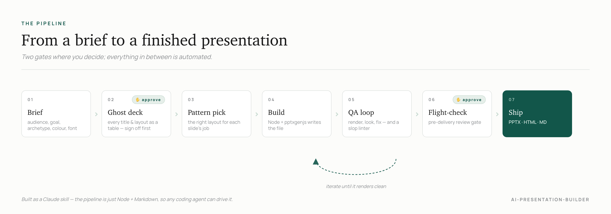

# ai-presentation-builder

A Claude skill that turns a brief into a consulting-grade presentation: diagnostics, recommendations, roadmaps, market-entry analyses, board briefings, pitches. It ships as editable PowerPoint, HTML, or Markdown.

Most AI deck tools give you generic, slop-looking slides: cream backgrounds, one font everywhere, accent bars down the side, the same three-bullet framework on every slide. This one is built against an anti-slop catalogue. It interviews you, structures the narrative on a cheap "ghost deck" before drafting a single slide, picks the right layout for each slide's job, and builds a real file you can open in PowerPoint or Google Slides and keep editing.

<picture>
  <source media="(prefers-color-scheme: dark)" srcset="assets/workflow-dark.png">
  
</picture>

## What it does

- **Briefs before building.** Two quick rounds of questions fix the audience, the goal, the archetype, the theme, and the headline font. Nothing gets drawn until the brief is set.
- **Structures on the cheap version first.** It emits a ghost deck (every slide's action title, breadcrumb, and chosen layout as a table) and gets your sign-off before drafting any body content. Throwing away ten titles is faster than throwing away ten finished slides.
- **Picks the layout that fits the slide's job.** A 40+ pattern library, tagged by role (compare, decompose, rank, sequence, show-change, narrow) and arrangement, plus a filter that surfaces only the patterns that suit your archetype.
- **Builds real, editable slides.** A Node/pptxgenjs pipeline writes the file. Bars are hand-drawn so they survive the PowerPoint to Google Slides round-trip. Charts follow honesty rules: no 3D, y-axis at zero, label lines direct, logical bar order.
- **Reviews before it ships.** A render-and-look QA loop plus a static slop linter, and an optional pre-flight gate via the sibling [flight-check](https://github.com/analystacademy/flight-check) skill.

## The design system

Every deck picks one of **eight curated themes**, each a complete, taste-vetted palette (ground, neutrals, accent, default font), not just an accent on a fixed ground:

- **Light:** Bright White & Pine (default), Slate, Oxblood, Solarized, Paper, Mono.
- **Dark:** Ink (cool charcoal), Midnight (navy and gold).
- **Fonts:** eight vetted display faces. Charter (default), Palatino, Iowan Old Style, Baskerville, Hoefler Text, Cochin, Optima, Manrope Bold (all-sans). Body is always Manrope; pick any per deck.

What's locked is *taste*, not one look. Every theme is one accent, cohesive neutrals, and emphasis by weight, hairline, and whitespace, with no dark-mode glow, no generic cream, no rainbow, and no gradient. The two dark themes are deliberately designed, not inverted defaults. For brand-locked work, supply a hex to override the chosen theme's accent. Full token sets and the dark-theme semantics live in [`references/design_system.md`](references/design_system.md).

`assets/reference-build.js` is a complete, render-tested worked example. Run it to see the system:

```bash
npm install
npm run example          # writes reference-build.pptx
```

## Requirements

- **Node.js** (18+) and **pptxgenjs** (`npm install`): needed to build the file.
- **LibreOffice** (`soffice`): optional, enables the render-to-PNG QA loop. Without it, the deck still builds; you just QA the file directly.
- **Fonts:** the theme display faces (Charter, Palatino, Iowan Old Style, Baskerville, Hoefler Text, Cochin, Optima) plus Manrope render best when installed. The build falls back gracefully if they are not.

## Install

Which steps you follow depends on which Claude you use. **Claude Code** reads the skill straight from a folder. The app versions (**claude.ai**, the **desktop app**, and **Cowork**) install by uploading one zip file.

### Get the zip (for the app versions)

Two ways to get `ai-presentation-builder.zip`:

- **Download it (no tools needed):** grab `ai-presentation-builder.zip` from the [latest release](https://github.com/umarmsharif/ai-presentation-builder/releases/latest).
- **Build it (git + node):** run `git clone https://github.com/umarmsharif/ai-presentation-builder.git`, then `cd ai-presentation-builder && npm run pack`. That writes the same ~150 KB zip (no `node_modules`, no `.git`, no preview images). Do not zip the folder by hand, which bundles the multi-megabyte `node_modules`.

### 1. Claude Code (the command-line tool)

The terminal version. It builds the finished PowerPoint for you, so it is the most capable option. No zip needed here.

```bash
git clone https://github.com/umarmsharif/ai-presentation-builder.git ~/.claude/skills/ai-presentation-builder
cd ~/.claude/skills/ai-presentation-builder && npm install
```

Quit and reopen Claude Code, then say "build me a board deck on [topic]" (or "make a strategy presentation", "turn this into a deck").

### 2. claude.ai (in a web browser)

1. Get the zip (above).
2. Click your name at the bottom-left, then **Settings → Capabilities → Skills**.
3. Click **Upload skill** and choose the zip.
4. Start a new chat and describe the deck you want.

You get the slide-by-slide outline and a per-slide spec to render in PowerPoint, Google Slides, or Gamma. The browser version does not produce the file itself.

### 3. Claude desktop app (Chat)

The Claude app on your Mac or Windows, in normal chat mode.

1. Get the zip.
2. Open **Settings → Capabilities → Skills** and upload it. Skills are tied to your account, so an upload on claude.ai already covers this.
3. Start a chat and describe the deck.

Same result as the browser: the outline and spec, not a built file.

### 4. Claude Cowork (inside the desktop app)

Cowork gives Claude a real workspace that can run code and create files. This is the version that produces the actual PowerPoint.

1. Get the zip.
2. Upload it the same way (**Settings → Capabilities → Skills**); one upload covers both Chat and Cowork.
3. Open a Cowork session and ask for the deck.

Cowork installs what it needs and runs the build, so you get a finished, editable `.pptx` plus rendered previews of each slide.

## Usage

Describe what you need, at any level of roughness:

- "A diagnostic deck on why our activation is stalling, for the board, 10 slides."
- "Turn these notes into a market-entry recommendation."
- "Pitch deck for our seed round."

The skill asks the brief questions, shows you the ghost deck, and builds once you approve the structure. Ask for "variations" on any slide to see two or three layout treatments side by side.

## What's inside

```
ai-presentation-builder/
├── SKILL.md                         # the workflow: brief, ghost deck, build, QA, flight-check
├── assets/
│   ├── inputs.example.json          # the deck schema, worked example
│   └── reference-build.js           # complete render-tested pptxgenjs exemplar (theme-driven)
├── scripts/
│   ├── pattern_filter.js            # surfaces archetype-eligible patterns
│   ├── deck_qa.js                   # static anti-slop linter
│   └── check_titles.js              # action-title checker
├── references/
│   ├── design_system.md             # 8 curated themes: palettes, type, anatomy, semantic tokens
│   ├── slide_patterns.md            # the pattern catalogue + universal conventions
│   ├── build-helpers.md             # pptxgenjs recipes for every pattern + gotchas
│   ├── anti-slop.md                 # the AI-tell catalogue mapped to deck relevance
│   ├── chart-selection-guide.md     # message to chart-type mapping
│   ├── chart-library/               # 6 distilled chart patterns + design rules
│   ├── visual-primitives/           # 11 render-tested diagram primitives + previews
│   ├── methodology/                 # content interview, QA checklist, slide-type canon
│   ├── slide-job-to-layout.md       # traceable pattern selection
│   └── raci-guidance.md             # role-ownership slide guidance
├── package.json
├── LICENSE
└── README.md
```

## Compatibility

- **AskUserQuestion:** used for the brief and the ghost-deck gate. Where it is unavailable, the same questions are asked inline.
- **Code execution + Node/pptxgenjs:** required for the full file build. Without it, the skill degrades to the ghost-deck outline plus a per-slide spec.
- **LibreOffice/soffice:** optional, for the render-QA loop.

## Pairs with

- [flight-check](https://github.com/analystacademy/flight-check): the pre-delivery review gate. Build here, review there, ship after both pass.

## License

MIT © 2026 Umar Sharif. See [LICENSE](LICENSE). Use it, fork it, adapt it.

Charts and patterns are distilled from public consulting work for design study; build every chart from your own data. See `references/chart-library/SOURCES.md`.
